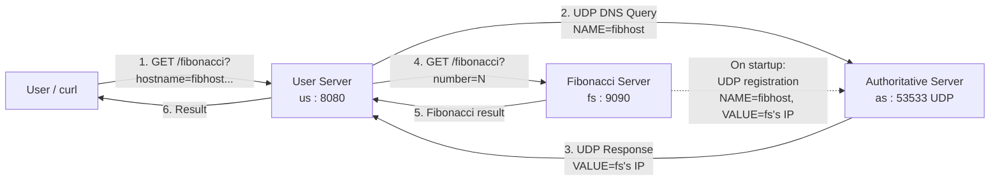

# DNS-Style Service Discovery + Fibonacci Microservice Demo

A small distributed systems demo built with Docker, Flask, and raw UDP sockets. Three independent services simulate how DNS-based service discovery works in real-world microservice architectures — a client looks up a service by *name*, not by hardcoded IP, resolves it through a directory service, then calls it directly.

## Architecture



| Service | Role | Port | Protocol |
|---|---|---|---|
| `as` — Authoritative Server | Stores `hostname → IP` records, answers lookups | `53533` | Raw UDP |
| `fs` — Fibonacci Server | Registers itself with `as`; computes Fibonacci numbers | `9090` | HTTP (Flask) |
| `us` — User Server | Resolves a hostname via `as`, then calls `fs` | `8080` | HTTP (Flask) |

## Why this exists

Real services shouldn't be hardcoded to each other's IP addresses — servers restart, scale, move. This project models that pattern in miniature: `fs` announces itself to a directory (`as`) instead of being wired directly into `us`. `us` looks up the current address at request time, the same way DNS resolution works for real domain names.

## Project structure

```
dns-fib-app/
├── docker-compose.yml
├── README.md
├── as/
│   ├── Dockerfile
│   └── authoritative_server.py
├── fs/
│   ├── Dockerfile
│   └── fibonacci_server.py
└── us/
    ├── Dockerfile
    └── user_server.py
```

## Prerequisites

- [Docker Desktop](https://www.docker.com/products/docker-desktop/) installed and running

## Getting started

Clone the repo and start all three services:

```bash
git clone <your-repo-url>
cd dns-fib-app
docker compose up --build
```

Leave that terminal running. In a second terminal, register the Fibonacci server with the directory service:

```bash
curl -X PUT http://localhost:9090/register \
  -H "Content-Type: application/json" \
  -d '{"hostname": "fibhost", "ip": "fs", "as_ip": "as", "as_port": 53533}'
```

Then request a Fibonacci number by hostname:

```bash
curl "http://localhost:8080/fibonacci?hostname=fibhost&fs_port=9090&number=10&as_ip=as&as_port=53533"
```

```
55
```

Stop everything:

```bash
docker compose down
```

## API reference

### `PUT /register` — on `fs` (port 9090)

Registers this Fibonacci server with the Authoritative Server.

**Body:**
```json
{
  "hostname": "fibhost",
  "ip": "fs",
  "as_ip": "as",
  "as_port": 53533
}
```

**Response:** `201 Registration successful`

### `GET /fibonacci` — on `fs` (port 9090)

**Query params:** `number` (int)
**Response:** The `number`-th Fibonacci number, `200 OK`

### `GET /fibonacci` — on `us` (port 8080)

Resolves `hostname` via the Authoritative Server, then forwards the request to that server's Fibonacci endpoint.

**Query params:** `hostname`, `fs_port`, `number`, `as_ip`, `as_port`
**Response:** The Fibonacci number returned by the resolved server, `200 OK`

## Custom DNS protocol (used internally between `us`/`fs` and `as`)

Plain-text messages sent over UDP to port `53533`:

**Registration**
```
TYPE=A
NAME=fibhost
VALUE=<ip>
TTL=103
```

**Query**
```
TYPE=DNS Query
NAME=fibhost
```

**Query response**
```
TYPE=A
NAME=fibhost
VALUE=<ip>
TTL=103
```

## Running without Docker (local debugging)

```bash
# Terminal 1
cd as && python authoritative_server.py

# Terminal 2
cd fs && python fibonacci_server.py

# Terminal 3
cd us && python user_server.py
```

Use `127.0.0.1` in place of `as` / `fs` for the `as_ip` and `ip` fields when testing locally this way.

## Notes / limitations

- The Flask servers run in development mode — not intended for production use.
- `as` persists records to a local JSON file inside its own container; data doesn't survive `docker compose down` unless a volume is added.
- No authentication or input validation beyond basic checks — this is a learning/demo project, not a production service mesh.

## License

MIT (or update to whatever you prefer).
